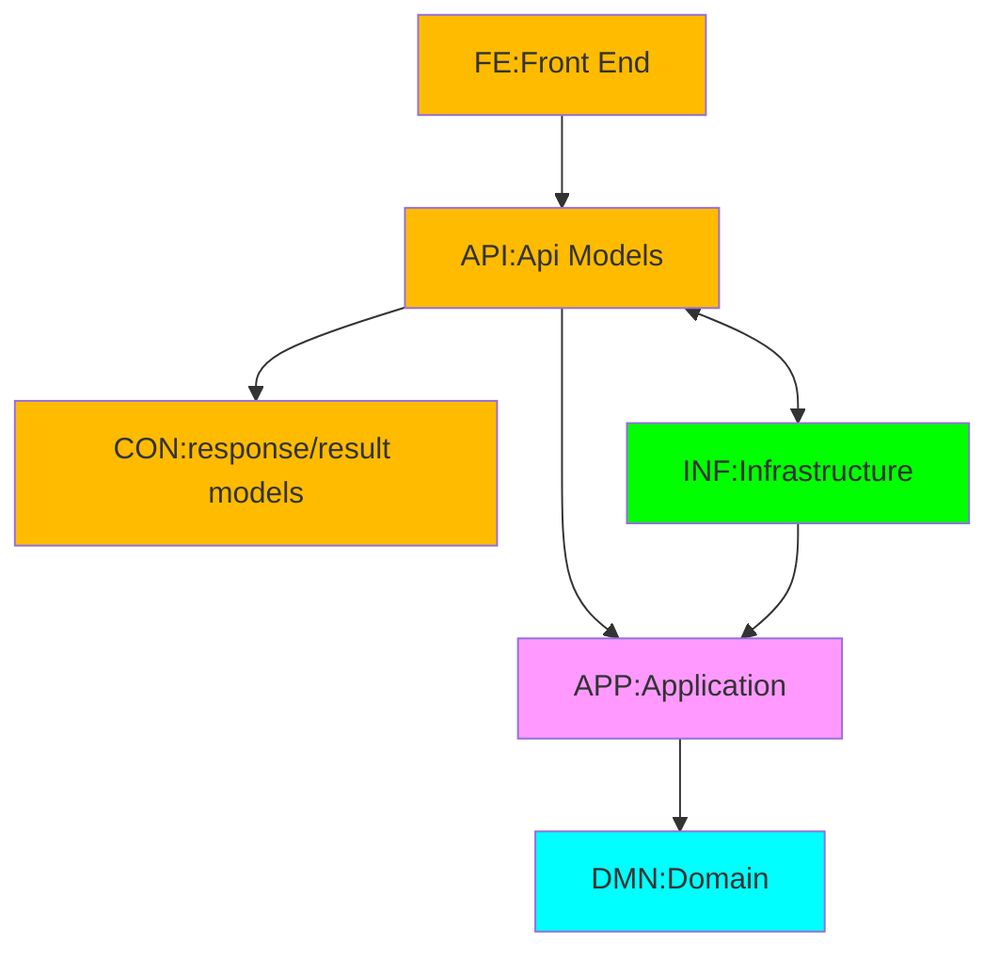
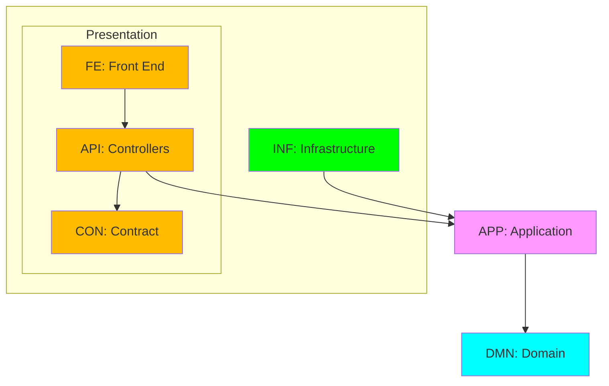

# Domain Driven Design

```mermaid
flowchart TD
    F[FE:Front End]
    C[CON:response/result models]
    P[API:Api Models] 
    I[INF:Infrastructure]
    AL[APP:Application]
    D[DMN:Domain]
    F --> P
    P --> AL
    I --> AL
    AL --> D
    P <--> I
    P --> C

style F fill:#fb0
style P fill:#fb0
style C fill:#fb0
style AL fill:#f9f
style I fill:#0f0
style D fill:#0ff

```

```mermaid
flowchart TD
subgraph L[" "]
direction LR
subgraph Z["Presentation"]
  direction LR
    F[FE: Front End] --> P[API: Controllers]
    P --> C[CON: Contract]
  end
  I[INF: Infrastructure]
  
end

AL[APP: Application]-->
D[DMN: Domain]

P--> AL
I--> AL

style F fill:#fb0
style P fill:#fb0
style C fill:#fb0
style AL fill:#f9f
style I fill:#0f0
style D fill:#0ff

```

```bash
dotnet watch run --project 01-Apps.Api
dotnet run --project 01-Apps.Api
```

[Back][1]

[1]:../../readme.md