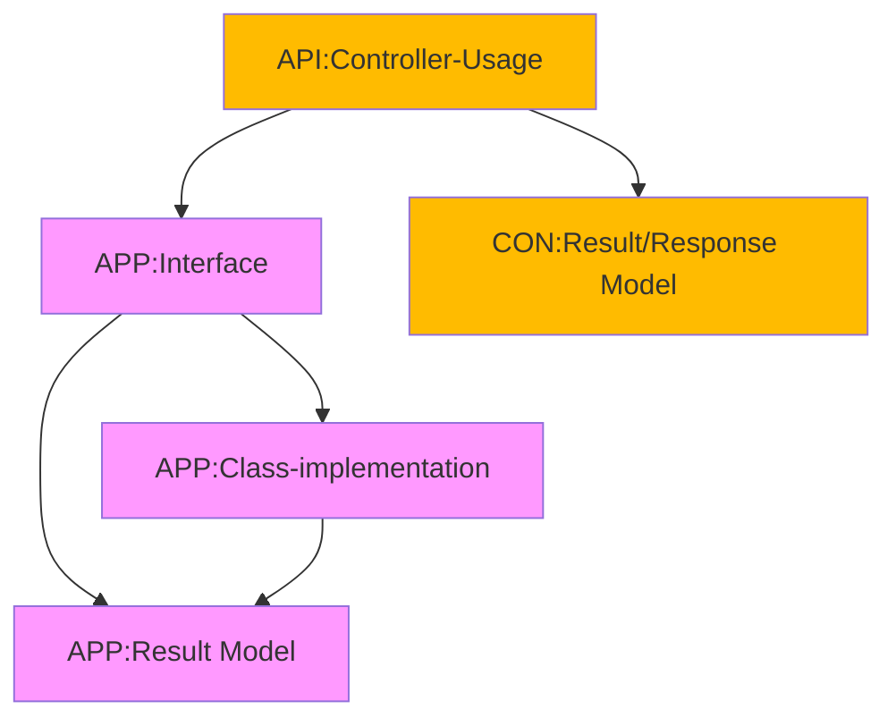

## Setting Up Login

[Back][1]

1. Create [Request][2] and [Response][3] Record in Contracts Project
1. Create [Authetication][4] Controller in Api Project
1. Create Auth [interface][5], [implementation][6] and [Response Model][7] in Application Project

```csharp
public class AuthService : IAuthService
{
  public AuthResult Login(string Username, string Password)
  {
    return new AuthResult(
        Guid.NewGuid(),
        Username,
        "Fistname",
        "Lastname",
        "Email",
        "Token"
    );
  }

  public AuthResult Register(string Username, string Password, string FirstName, string LastName, string Email)
  {
    return new AuthResult(
        Guid.NewGuid(),
        Username,
        FirstName,
        LastName,
        Email,
        "Token"
    );
  }
}
```
4. Use Interface in [Controller][C]
```csharp
public class AuthController : ControllerBase
{
  private readonly IAuthService _authService;
  public AuthController(IAuthService authService)
  {
      _authService = authService;
  }
...
}
```
or as primary constructor
```cs
[ApiController]
[Route("auth")]
public class AuthController(IAuthService authService) : ControllerBase
{
  private readonly IAuthService _authService = authService;

  [HttpPost("register")]
  public IActionResult Register(RegisterRequest request)
  {
    var authResult = _authService.Register(
        request.Username,
        request.Password,
        request.FirstName,
        request.LastName,
        request.Email
        );
    
    //Map to Contract Response
    var resisterResponse = new AuthResponse(      
        authResult.Id,
        authResult.Username,
        authResult.FirstName,
        authResult.LastName,
        authResult.Email,
        authResult.Token
    );
    return Ok(resisterResponse);
  }

  [HttpPost("login")]
  public IActionResult Login(LoginRequest request)
  {
    var loginResult = _authService.Login(
        request.Username,
        request.Password);
    
    //Map to Contract Response
    var loginResponse = new AuthResponse(
        loginResult.Id,
        loginResult.Username,
        loginResult.FirstName,
        loginResult.LastName,
        loginResult.Email,
        loginResult.Token
    );
    return Ok(loginResponse);
  }
}
```

5. Wire the interface in [Program.cs][8]
```cs
  builder.Services.AddScoped<IAuthService,AuthService>();
```

## Setup Dependency Injection Per Project

> Add Package Microsoft.Extensions.DependencyInjection.Abstractions
```bash
dotnet add .\02-Apps.Application package Microsoft.Extensions.DependencyInjection.Abstractions
```
1. Create Application [Dependecy Injection class][9]
1. Create Infrastructure [Dependecy Injection class][10]
1. Rewire [Program.cs][8] to use project Dependency Injections
```cs
  builder.Services
    .AddInfrastructure()
    .AddApplication()
    ;
```

## Code Flow


1. Create Presentation Model Record in Contract
1. Create Application Model Record
1. Create interface definition 
1. Implement Method
1. Use Method in controller
1. Wire Interface to Implementation in API Program.cs (main and only Program.cs)

[Top][0] | [Back to main][1]

[0]:#setting-up-login
[1]:../../readme.md
[2]:../../Apps/01-Apps.Contracts/Auth/LoginRequest.cs
[3]:../../Apps/01-Apps.Contracts/Auth/AuthResponse.cs

[4]:../../Apps/01-Apps.Api/Controllers/AuthController.cs
[5]:../../Apps/02-Apps.Application/Services/Auth/IAuthService.cs
[6]:../../Apps/02-Apps.Application/Services/Auth/AuthService.cs
[7]:../../Apps/02-Apps.Application/Services/Auth/AuthResult.cs
[C]:../../Apps/01-Apps.Api/Controllers/AuthController.cs
[8]:../../Apps/01-Apps.Api/Program.cs
[9]:../../Apps/02-Apps.Application/DependencyInjection.cs
[10]:../../Apps/01-Apps.Infrastructure/DependencyInjection.cs
