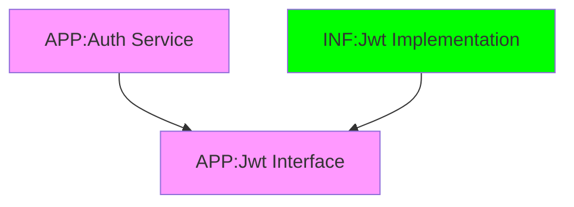

# JWT
[Back][1]
> Package Requirements
```bash
dotnet add .\01-Apps.Infrastructure package System.IdentityModel.Tokens.Jwt
```
## Codes
1. Create [JWT Token Generator Interface in Application Project][3]
1. create new [AppSettings Section][40] for the varible to be used in Jwt Generator Implementation
```json
  "JwtSettings":{
    "Secret": "super-super-duper-over-duper-secret",
    "ExpiryMinutes": 60,
    "Issuer": "BuberDinner",
    "Audience": "BuberDinner"
  },
```
4. [Model the AppSettings Section][41]
1. Create [JWT Token Generator Implementation in Infrastructure Project][4]
1. Modify [Auth Service][5] to use JWT and complete logic for Register
From
```csharp
  public AuthResult Register(string Username, string Password, string FirstName, string LastName, string Email)
  {
    return new AuthResult(
        Guid.NewGuid(),
        Username,
        FirstName,
        LastName,
        Email,
        "Token"
    );
  }

```
To
```csharp
  public AuthResult Register(string Username, string Password, string FirstName, string LastName, string Email)
  {
    var userId = Guid.NewGuid();

    // Create JWT Token
    var token = _jwtToken.GenerateToken(
        userId,
        FirstName,
        LastName);

    return new AuthResult(
        userId,
        Username,
        FirstName,
        LastName,
        Email,
        token
    );
  }

```
7. Wire the service to [Infrastructure][6] Project dependency Injection
```csharp
services.AddSingleton<IJwtTokenGenerator,JwtTokenGenerator>();
```

### Creating Model For AppSettings Section

1. Create [Settings Model][42]
```csharp
namespace Apps.Infrastructure.Auth;
public class JwtSettings
{
  public const string SectionName = "JwtSettings";
  public string Secret { get; init; } = null!;
  public int ExpiryMinutes { get; init; }  
  public string Issuer { get; init; } = null!;
  public string Audience { get; init; } = null!;
}
```
2. Modify [Program.cs][43] to pass the configuration to the Infrastructure DI
```cs
  builder.Services
    .AddInfrastructure(builder.Configuration)
```
3. Add the parameter to [Infrastructure DI][44] and wire the class

> Package Requirements
```bash
dotnet add .\01-Apps.Infrastructure package Microsoft.Extensions.Configuration
dotnet add .\01-Apps.Infrastructure package Microsoft.Extensions.Options.ConfigurationExtensions
```
```cs
  public static IServiceCollection AddInfrastructure(
      this IServiceCollection services,
      ConfigurationManager configuration)
  {
    services.Configure<JwtSettings>(configuration.GetSection(JwtSettings.SectionName));
    services.AddSingleton<IDateTimeProvider,DateTimeProvider>();
    services.AddSingleton<IJwtTokenGenerator,JwtTokenGenerator>();
    return services;
  }
```




### User Secret
```bash
dotnet user-secrets init --project .\01-Apps.Api\Apps.Api.csproj
dotnet user-secrets set --project .\01-Apps.Api\Apps.Api.csproj "JwtSettings:Secret" "super-secret-key-super-secret-key"

dotnet user-secrets list --project .\01-Apps.Api\Apps.Api.csproj
```
[Top][0] | [Back to main][1]

[0]:#jwt
[1]:../../readme.md
[2]:../../Apps/03-Apps.Domain/Entities/User.cs
[3]:../../Apps/02-Apps.Application/Common/Interfaces/Auth/IJwtTokenGenerator.cs
[4]:../../Apps/01-Apps.Infrastructure/Auth/JwtTokenGenerator.cs
[40]:../../Apps/01-Apps.Api/appsettings.json
[41]:#creating-model-for-appsettings-section
[42]:../../Apps/01-Apps.Infrastructure/Auth/JwtSettings.cs
[43]:../../Apps/01-Apps.Api/Program.cs
[44]:../../Apps/01-Apps.Infrastructure/DependencyInjection.cs
[5]:../../Apps/02-Apps.Application/Services/Auth/AuthService.cs
[6]:../../Apps/01-Apps.Infrastructure/DependencyInjection.cs