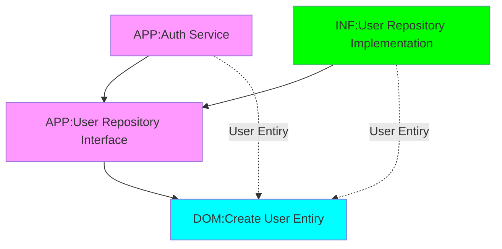

# Repository Pattern
[Back][1]

1. Create [User Entity][2] in the Domain Project
1. Create [User Repository interface][3] in the Application Project
1. Create [User Repository Implementation][4] in the Infrastucture Project
1. Register Service in [Infrastructure DI][5]
```cs
    services.AddScoped<IUserRepository,UserRepository>();
```
5. Modify [Auth Service][6] to use user repository and to contructor
```csharp
public class AuthService(
    IJwtTokenGenerator jwtToken,
    IUserRepository userRepository) : IAuthService
{
    private readonly IJwtTokenGenerator _jwtToken = jwtToken;
    private readonly IUserRepository _userRepository = userRepository;
...
}
```
6. Use Service in Login and Register Modules of [Auth Service][6]
```csharp
  public AuthResult Login(string Username, string Password)
  {
    if(_userRepository.GetByEmail(Username) is not User loginData)
    {
      throw new Exception("User not found");
    }
    if(loginData.Password != Password)
    {
      throw new Exception("User incorect");
    }
    var token = _jwtToken.GenerateToken(
      loginData.Id,
      loginData.FirstName,
      loginData.LastName
    );

    return new AuthResult(
      Msg: "",
      Success: true,
      Line: new AuthResultLine(
        loginData.Id,
        loginData.Username,
        loginData.FirstName,
        loginData.LastName,
        loginData.Email,
        token
      )
    );
  } //End Method Login

  public AuthResult Register(
      string Username,
      string Password,
      string FirstName,
      string LastName,
      string Email)
  {

    // Check if user already exist
    var authResult = _userRepository.GetByEmail(Email);
    if(authResult is not null){
      throw new Exception ("User with the given email already exists");
    }
    // Create User
    var userData = new User
    {
      Username = Username,
      FirstName = FirstName,
      LastName = LastName,
      Email = Email,
      Password = Password
    };

    //Persist Data / Save to DB
    _userRepository.Add(userData);

    // Create JWT Token
    var token = _jwtToken.GenerateToken(
      userData.Id,
      FirstName,
      LastName
    );

    return new AuthResult(
      Msg: "",
      Success: true,
      Line: new AuthResultLine(
        userData.Id,
        userData.Username,
        userData.FirstName,
        userData.LastName,
        userData.Email,
        token
      )
    );
  } //End Method Register

```



[Top][0] | [Back to main][1]

[0]:#repository-pattern
[1]:../../readme.md
[2]:../../Apps/03-Apps.Domain/Entities/User.cs
[3]:../../Apps/02-Apps.Application/Common/Interfaces/Persistence/IUserRepository.cs
[4]:../../Apps/01-Apps.Infrastructure/Persistence/UserRepository.cs
[5]:../../Apps/01-Apps.Infrastructure/DependencyInjection.cs
[6]:../../Apps/02-Apps.Application/Services/Auth/AuthService.cs