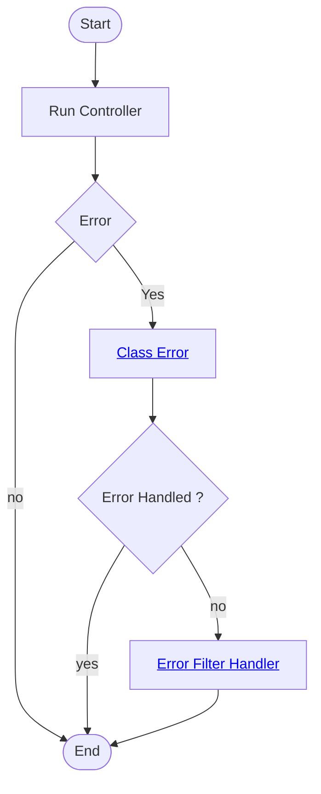

# Global Error Handling
[Back][1]

### Via Middelware

> Using Error handling class: Will catch any exception and wraps the rest of the pipeline

1. Create [error handling class][2]
```cs
    public async Task Invoke(HttpContext context)
    {
        try
        {
          //Will execute the next middleware - from Program.cs -> app.UseHttpsRedirection();
          await _next(context);
        }
        catch (Exception ex)
        {
          // Will be executed when error occurs
          await HandleExceptionAsync(context, ex);
        }
    }
```

2. Register error handling in [Program.cs][3] 
```cs
    app.UseMiddleware<ErrorHandlingMiddleware>();
```

### Via Exception filter attribute
[Back][1]
> This will catch any unhandled exceptions returned by the controller that is not an http response exception

1. Comment approach 1 error handling middleware 
2. Create [error handling filter][4]
```cs
public class ErrorHandlingFilterAttributes : ExceptionFilterAttribute
{
    // This is invoked when an exception is thrown and was not hadled by the application
    public override void OnException(ExceptionContext context)
    {
      var exception = context.Exception;
      context.Result = new ObjectResult(new { error = "From Filters: An Error Occured while processing your request" })
      {
        StatusCode = 500
      };
      context.ExceptionHandled = true;
    }
}
```
3. Add the Attribute to the [controller][5]
```csharp
[ApiController]
[Route("auth")]
[ErrorHandlingFilterAttributes]
public class AuthController(IAuthService authService) : ControllerBase
{
...
}
```

3. Or Add the filter option on all controller in [Program.cs][3]
```cs
    builder.Services.AddControllers(
        options => options.Filters.Add<ErrorHandlingFilterAttributes>()
    );
```
> Take note of the Content-Type: application/problem+json; charset=utf-8

### Using ProblemDetails
[Back][1]
ProblemDetails Uses rfc standard error handling: Error Filter Handler

1. Modify the [filter class][4] to use Microsoft.AspNetCore.Mvc ProblemDetails
```cs
      var problemDetails = new ProblemDetails
      {
        Type = "https://tools.ietf.org/html/rfc7231#section-6.6.1",
        Title = "From Filters using problem Details: An Error Occured while processing your request",
        Status = (int)HttpStatusCode.InternalServerError,
      };

```
2. change filter codes to use prblem details
```cs
  context.Result = new ObjectResult(problemDetails);
```

## Via Error EndPoint
[Back][1]
> Implementation Via Error EndPoint: Class Error

1. Remove filter options in [Program.cs][3]
```cs
  builder.Services.AddControllers();
```

2. Use exeption handling
```cs
  app.UseExceptionHandler("/error");
```

3. Create  [Error Handling Controller][6]


### Error Handling Flow
[Back][1]
<div style="text-align: center;">



</div>

### Customize

1. Create [Custome Problem Detailed factory][7] copied from [aspnet core codes in gitlhub][8]
1. Overwrite ProblemDetailsFactory defaults in [Program.cs][3]

```cs
builder.Services.AddSingleton<ProblemDetailsFactory,AppsProblemDetailsFactory>();
```

### hot reload
```bash
dotnet watch run --project 01-Apps.Api
```


[Top][0] | [Back to main][1]

[0]:#error-handling
[1]:../../readme.md
[2]:../../Apps/01-Apps.Api/Middleware/ErrorHandlingMiddleware.cs
[3]:../../Apps/01-Apps.Api/Program.cs
[4]:../../Apps/01-Apps.Api/Filters/ErrorHandlingFilterAttributes.cs
[5]:../../Apps/01-Apps.Api/Controllers/AuthController.cs
[6]:../../Apps/01-Apps.Api/Controllers/ErrorController.cs
[7]:../../Apps/01-Apps.Api/Errors/AppsProblemDetailsFactory.cs
[8]:https://github.com/dotnet/aspnetcore/blob/main/src/Mvc/Mvc.Core/src/Infrastructure/DefaultProblemDetailsFactory.cs