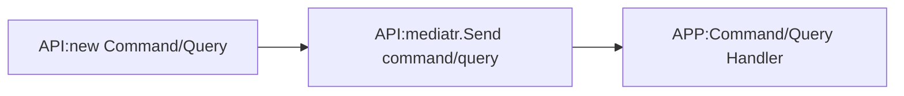

### CQRS
[Back][1]

> Separate Command from Query
Command: With changes in State/DB/Persistance (Manipulates Data)
Query: No change 

CQS:  Command Query Separation - For Method only
CQRS: Command Query Resposibility Segregation

Sample changes in codes

From
```bash
Application->Services
  AuthenticationService.cs
  IAuthenticationService.cs
  AuthenticationResult.cs
```
To
```bash
Application->Services->Command
  AuthenticationCommandService.cs
  IAuthenticationCommandService.cs

Application->Services->Query
  AuthenticationQueryService.cs
  IAuthenticationQueryService.cs

Application->Services->Common
  AuthenticationResult.cs
```
Register will be in Command -> Changes something on DB
Login will be in Query-> Query only no data manipulation

### MediatR
> For net8.0 
```bash
dotnet add Apps\02-Apps.Application package MediatR --version 11.1.0
dotnet add Apps\02-Apps.Application package MediatR.Extensions.Microsoft.DependencyInjection --version 11.1.0
```
> Separate Command from Query by function
```
Application->Authentication->Command->Register
  RegisterCommand.cs
  RegisterCommandHandler.cs
Application->Authentication->Queries->Login
  LoginQuery.cs
  LoginQueryHandler.cs
Application->Authentication->Common
  AuthenticationResult.cs
```
### Create files and folder
```bash
mkdir Apps\02-Apps.Application\Authentication\Command\Register
touch Apps\02-Apps.Application\Authentication\Command\Register\RegisterCommand.cs
touch Apps\02-Apps.Application\Authentication\Command\Register\RegisterCommandHandler.cs

mkdir Apps\02-Apps.Application\Authentication\Queries\Login
touch Apps\02-Apps.Application\Authentication\Queries\Login\LoginQuery.cs
touch Apps\02-Apps.Application\Authentication\Queries\Login\LoginQueryHandler.cs

mkdir Apps\02-Apps.Application\Authentication\Common
touch Apps\02-Apps.Application\Authentication\Common\AuthResult.cs
```
> Delete Services Folder Apps\02-Apps.Application\Services
```bash
rd /s/q Apps\02-Apps.Application\Services
```
> remove refernce to auth service and [wire MediatR][2] in DI of Application project
```cs
using Microsoft.Extensions.DependencyInjection;
using MediatR;

namespace Apps.Application;

public static class DependencyInjection
{
  public static IServiceCollection AddApplication(this IServiceCollection services)
  {
    services.AddMediatR(typeof(DependencyInjection).Assembly);
    return services;
  }
}
```
### Code Flow

AH is determined on which handles the record Command/Query

```cs
public record RegisterCommand(
  string Username,
  string FirstName,
  string LastName,
  string Email,
  string Password) : IRequest<ErrorOr<AuthResult>>;
```
```cs
public async Task<ErrorOr<AuthenticationResult>> Handle(RegisterCommand command, CancellationToken cancellationToken)
{
  //Handling logic - copied from original Auth Service implementation
}
```
Sample above are from RegisterCommand.cs and RegisterCommandHandler.cs

modify Auth controller
from
```cs
public class AuthController(IAuthService authService) : ApiController
{
  private readonly IAuthService _authService = authService;

  public IActionResult Register(RegisterRequest request)
  {
    ErrorOr<AuthResult> authResult = _authService.Register(request.Username, request.Password, request.FirstName, request.LastName, request.Email);
    
    return authResult.Match(
      a => Ok(MapAuthResult(a)),
      e => Problem(e)
    );

  } //End Method Reigister
  ...
}
```
to
```cs
  public async Task<IActionResult> Register(RegisterRequest request)
  {
    var command = new RegisterCommand(
      request.Username,
      request.FirstName,
      request.LastName,
      request.Email,
      request.Password);

    ErrorOr<AuthResult> authResult = await _mediator.Send(command);

    return authResult.Match(
      a => Ok(MapAuthResult(a)),
      e => Problem(e)
    );    

  } //End Method Reigister

```

[Top][0] | [Back to main][1]

[0]:#cqrs
[1]:../../readme.md
[2]:../../Apps/02-Apps.Application/DependencyInjection.cs