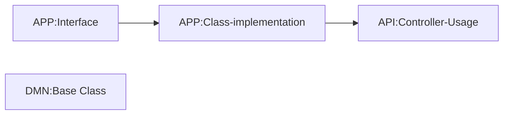

# Video 5 - Flow Control
[Back][1]

### Variantion 1 [Via Execption][2]
### Variantion 2
1. reset to video 4 output

### Variantion 2.1 - [OneOf][3]
  [Extraction of to new method][31]
### Variantion 2.2 - [FluentResults][4]
### Variantion 2.3 - [ErrorOr][5]
[Back to main][1]

## Code Flow

1. Create interface definition of Method
2. Implement Method in a class
3. Use Method in controller

[1]:../../readme.md
[2]:Video5-1-Via-Exception.md
[3]:Video5-2-OneOf.md
[31]:Video5-2-OneOf.md#extraction-of-new-method
[4]:Video5-3-FluentResults.md
[5]:Video5-4-ErrorOr.md